## 使用Pytorch通过卷积神经网络实现CIFAR10数据集的分类器

蔡云龙

智科一班

17363003

### 引言

在本次实验中，会使用Pytorch来实现一个卷积神经网络，之后对CIFAR-10数据集进行训练，保存训练模型参数，绘制loss图并保存，使用训练得到的模型对训练集与测试集的数据进行准确率测试，并将多次训练后得到的测试结果记录到对应的csv文件中。

### CIFAR-10数据集

CIFAR10数据集一共有60000张32*32的彩色图，共有十类，每类6000张，其中5000张训练图，1000张测试图；也就是一共有50000张图用来训练，10000张图用来测试。

十类分别是：plane, car, bird, cat, deer, dog, frog, horse, ship, truck.

更多关于CIFAR-10和CIFAR-100的信息可以看[这里](https://www.cs.toronto.edu/~kriz/cifar.html)

### 事前准备

- 声明：**文档中的代码在拷贝与修改的过程中可能会有错误，具体以实际的代码为准**

- 在data文件夹的声明CIFAR10数据文件夹中创建一个文件夹叫save_model，用来存储训练得到的模型参数

- 使用createcsv.py创建两个csv文件，用来存储每次训练之后测试得到的训练集与测试集的准确度，因为想是csv文件中第一行写上10个类别与总的准确度，以后每次测试完都在下面追加，就把第一行单独先写好，以后测试完直接打开追加即可，代码如下：

  ```python
  import csv
  
  classes = ['plane', 'car', 'bird', 'cat', 'deer', 'dog', 'frog', 'horse', 'ship', 'truck','Total']
  
  with open('TrainAccHistory.csv', 'w', newline='', encoding='utf-8') as f:
      writer = csv.writer(f)
      writer.writerow(classes)
  
  with open('TestAccHistory.csv', 'w', newline='', encoding='utf-8') as f:
      writer = csv.writer(f)
      writer.writerow(classes)
  ```

- 下载数据集，可以通过[链接](https://www.cs.toronto.edu/~kriz/cifar-10-python.tar.gz)直接下载，下载完记得在对应的data文件夹里解压，不然会报错，当然也可以在代码中通过设置download属性进行下载，后面放出来。

### 开始实验

#### 导入需要的模块

我们需要torch模块来创建网络，优化器，损失函数等；需要torchvision模块将下载的数据集做成dataset与loader，以便后续操作；需要matplotlib下的pyplot子库来显示一些图片，绘制并保存loss图；需要os库对文件夹内容进行判断以确定不同的行动分支；使用numpy显示一些数据集中的图片；需要time库查看训练时间等(可以不要)；需要csv库将测试结果存到对应的csv文件中。

```python
import torch
import torch.nn as nn
import torch.nn.functional as F 
import torch.optim as optim 
import torch.utils.data as Data  # to make Loader
import torchvision
import torchvision.transforms as transforms
import matplotlib.pyplot as plt 
import os
import numpy as np 
import time
import csv
```

#### 初始化一些参数

包括训练迭代的次数EPOCH；每次训练的批数目BATCH_SIZE；学习率LR；是否下载数据集DOWNLOAD_CIFAR10；

device用来表示使用cpu还是gpu；transform用来将数据进行能够训练的转化；还有10类数据的名字

```python
EPOCH = 2
BATCH_SIZE = 4
LR = 0.001
DOWNLOAD_CIFAR10 = False
device = torch.device("cuda:0" if torch.cuda.is_available() else "cpu")
transform = transforms.Compose(
    [transforms.ToTensor(),
    transforms.Normalize((0.5, 0.5, 0.5), (0.5, 0.5, 0.5))]
)

train_data = torchvision.datasets.CIFAR10(
    root='./data',
    train=True,
    download=DOWNLOAD_CIFAR10,
    transform=transform
)
train_loader = Data.DataLoader(
    train_data,
    batch_size=BATCH_SIZE,
    shuffle=True,
    # num_workers=2 # ready to be commented(windows)
)

test_data = torchvision.datasets.CIFAR10(
    root='./data',
    train=False,
    download=DOWNLOAD_CIFAR10,
    transform=transform,
)
test_loader = Data.DataLoader(
    test_data,
    batch_size=BATCH_SIZE,
    shuffle=False,
    # num_workers=2
)

classes = ('plane', 'car', 'bird', 'cat', 'deer', 'dog', 'frog', 'horse', 'ship', 'truck')
```

其中的一些参数说明：root表示数据集所在的目录；train=True表示将是训练集的数据提出来，False就是将测试的那部分提出来；download表示是否进行下载，因为前面用链接下载解压过了，所以设置的DOWNLOAD_CIFAR10为False；transform表示进行相应转化(转成灰度以及其他格式)。DataLoader中的第一个参数表示用来做成迭代器Loader的数据集；第二个参数batch_size即为每次load出来的图片数；shuffle参数表示是否在每个epoch开始的时候将数据集重新打乱；num_workers表示用来处理data的进程数，在windows下抱错，直接注释掉即可。(参考[文档](https://www.jianshu.com/p/ecd4549a5819))

#### 显示一些图片

下面试着显示一下几张图，看看有没有load成功：

```python
def imshow(img):
    img = img /2 +0.5
    npimg = img.numpy()
    plt.imshow(np.transpose(npimg, (1,2,0)))
    plt.show()

dataiter = iter(train_loader)
images, labels = dataiter.next()
imshow(torchvision.utils.make_grid(images))
print(' '.join('%5s' % classes[labels[j]] for j in range(4)))
```

因为上面设置的batch_size为4，所以这里就打印4个labels，得到的结果是：

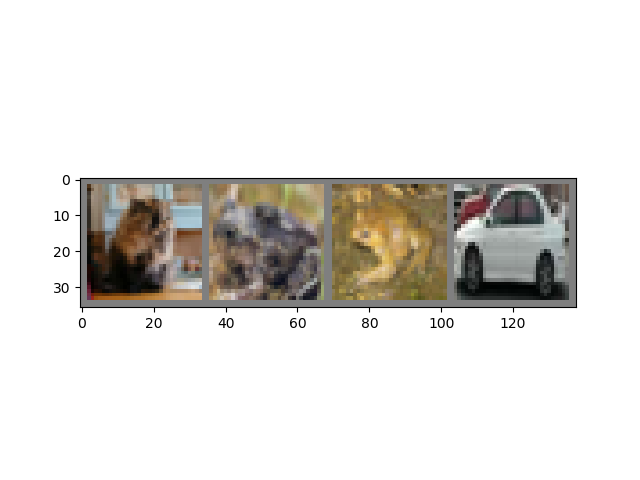

关闭窗口之后即可在终端看到对应的labels，分别为：  cat  frog  frog   car

将这段显示图片的注释掉，进行后续实验，不然每次运行都显示就有点烦（强迫症哈哈哈）

#### 定义卷积神经网络

采用LeNet5模型，即两层卷积核为5*5的卷积层，两层最大池化层，三层全连接层：

```python
class CNN(nn.Module):
    def __init__(self):
        super(CNN, self).__init__()
        self.conv1 = nn.Conv2d(3, 6, 5)
        self.pool = nn.MaxPool2d(2, 2)
        self.conv2 = nn.Conv2d(6, 16, 5)

        self.fc1 = nn.Linear(16*5*5, 120)
        self.fc2 = nn.Linear(120, 84)
        self.fc3 = nn.Linear(84, 10) # result is ten kinds of item

    def forward(self, x):
        x = self.pool(F.relu(self.conv1(x)))
        x = self.pool(F.relu(self.conv2(x)))
        x = x.view(-1, 16*5*5) # reshape to 16*5*5 to fc
        x = F.relu(self.fc1(x))
        x = F.relu(self.fc2(x))
        output = self.fc3(x)
        return output

cnn = CNN()
```

注意每次卷积之后都要经过一层激活层再进行最大池化层，激活函数用的是relu().

#### 定义损失函数与优化器

```python
optimizer = optim.Adam(cnn.parameters())
loss_func = nn.CrossEntropyLoss()
```

损失函数使用的CrocsEntropyLoss()， 优化器使用的是据说是优化器中的集大成者: Adam，不需要传入学习率，但是在保存模型参数的时候需要将Adam优化器的参数也要保存，以便下次在这个模型参数基础上训练时使用该参数，如果不保存可能会影响结果，于是将状态信息定义成下面这样：

```python
state = {'cnn': cnn.state_dict(), 'optimizer': optimizer.state_dict()}
```

包括卷积神经网络的状态以及优化器的状态，将来训练完之后保存。

绘制并保存loss图可以用如下方式实现：

```python
losses = [] # record losses
def save_losses(losses):
    t = np.arange(len(losses))
    plt.plot(t, losses)
    plt.savefig('loss.png')
    # plt.show()
```

#### 定义训练函数

下面定义训练函数，对train_loader load的数据进行训练:

```python
def train():
    global losses
    for epoch in range(EPOCH):
        running_loss = 0.0
        for step, (inputs, labels) in enumerate(train_loader, 0):
            # inputs, labels = data[0].to(device), data[1].to(device)
            inputs = inputs.to(device)  # 2
            labels = labels.to(device)
            
            optimizer.zero_grad()
            output = cnn(inputs)
            loss = loss_func(output, labels)

            loss.backward()
            optimizer.step()

            running_loss += loss.item()
            if step % 100 == 99:
                loss_num = running_loss / 100
                losses.append(loss_num)
                print('|epoch: %d, step: %5d| -> loss: %.3f|' %(epoch+1, step+1, loss_num))
                running_loss = 0.0
    # save losses
    save_losses(losses)
```

训练完之后调用上面定义的save_losses函数，保存此次训练的loss图像

#### 开始训练

训练需要判断模型参数保存的状态，因此加入分支：

```python
start = time.time()
model_save_path = './data/cifar-10-batches-py/saved_model/'
model_path = model_save_path + 'saved_model.pth'

if not os.path.exists(model_save_path):
    os.makedirs(model_save_path)
    
if os.path.isfile(model_path): # if there has been the file, train on it
    cnn.load_state_dict(torch.load(model_path)['cnn'])
    optimizer.load_state_dict(torch.load(model_path)['optimizer'])
    print("Loaded model parameters from disk successfully!")
    train()
    print("Training Finished!")
    torch.save(state, model_path)
    print("Model Saved Complete!")
else:
    train()
    print("Training Finished!")
    torch.save(state, model_path)
    print("Model Saved Complete!")
    
end = time.time()
print('takes:', end-start,'s')
```

第一个if：当不存在模型参数保存目录时，创建该目录。之后开始判断是否已经有参数：①如果已经有了，则使用torch.load函数读取参数，并使用正确的键值分别赋给cnn和optimizer，之后在此网络与优化器参数的基础上继续进行训练，最后打印一下训练大致用时。每次训练之后都要记得保存cnn与optimizer的状态。

#### 测试训练集与测试集的准确度

下面只放出对训练集的测试，对于测试集的测试，只需要将相应的train改成test即可：比如train_loader改成test_loader，train_total改成test_total，trainAccHistory.csv改成testAccHistory.csv等等即可：

```python
# test and get accuracy
correct_time = time.time()
classes_correct = [0 for i in range(10)]
classes_total = [0 for i in range(10)]
pass_total = 0
train_total = 50000
test_total = 10000
# test train_data
print("-----Test Train results-----")
with torch.no_grad():
    for (images, labels) in train_loader:
        output = cnn(images)
        _, prediction = torch.max(output, 1)
        c = (prediction == labels).squeeze()
        for i in range(BATCH_SIZE):
            label = labels[i]
            classes_correct[label] += c[i].item()
            classes_total[label] += 1

accNow = []
for i in range(len(classes)):
    print("%3d of %4d passed | accuracy of %5s -> %2d %%" % (classes_correct[i], classes_total[i], classes[i],round(100*classes_correct[i]/classes_total[i])))
    pass_total += classes_correct[i]
    accNow.append(str(round(100*classes_correct[i]/classes_total[i])) + '%')
accNow.append(str(round(100*pass_total/train_total)) + '%')
print("%3d of %4d passed | total accuracy is -> %2d %%" % (pass_total, train_total, round(100*pass_total/train_total)))
print()

with open('trainAccHistory.csv', 'a+', newline='', encoding='utf-8') as f:
    writer = csv.writer(f)
    writer.writerow(accNow)

now = time.time()
print('test takes:', now-correct_time,'s')
```

classes_correct表示测试匹配正确的对应类的个数， class_total对应的是每个类的总个数；pass_total是匹配正确的总个数(训练集的总个数/测试集的总个数)；train_total=50000, test_total=10000的意义就很明显了

#### 第一次尝试运行

发现可以正常顺利运行：运行最后的结果大致如下：

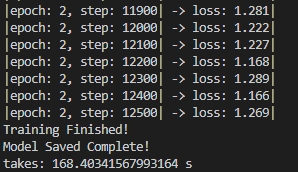

测试结果大致为：

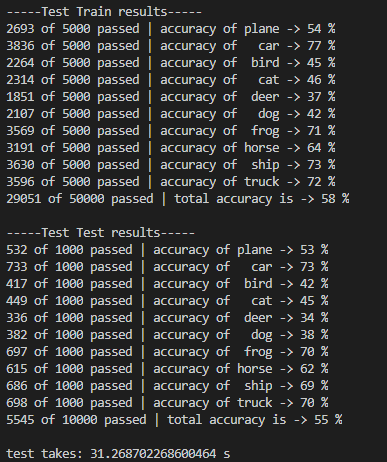

绘制的loss图像大体如下：

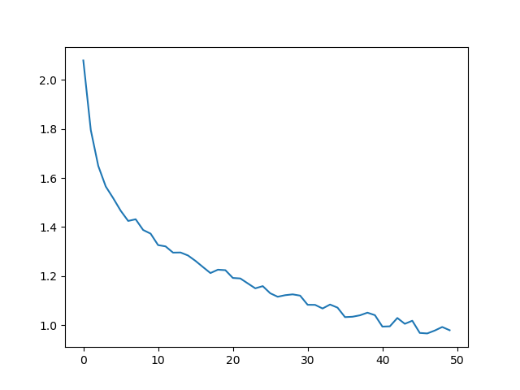


此时检查两个csv文件，可以发现，都新增了一行，并且对应的准确率与终端中显示的一致。

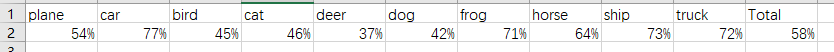

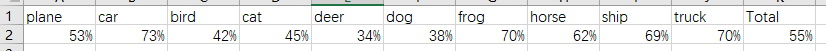

#### 使用GPU来训练

刚好之前辛辛苦苦装的GPU版的Pytorch，这次可以拿来试试，于是就查阅资料看看怎么用GPU来训练，找到两个版本：①初始化cnn之后使用cnn.cuda()语句，同时让从DataLoader中拿到的data也使用.cuda()方法；②初始化cnn之后使用cnn.to(device)，device即是之前最开始定义的那句 device = torch.device("cuda:0" if torch.cuda.is_available() else "cpu")，然后让相应的data使用to(device)方法，我这里使用的是第二种方法，大致位置：

```python
...
cnn = CNN()
cnn.to(device)
```

```python
# train函数中的一部分
for step, (inputs, labels) in enumerate(train_loader, 0):
    inputs = inputs.to(device) 
    labels = labels.to(device)
    
    optimizer.zero_grad()
    ...
```

```python
# test中的一部分
for (images, labels) in train_loader:
    images = images.to(device)
    labels = labels.to(device)
    output = cnn(images)
    ...
```

上面只贴出了测试训练集的一部分，因为测试测试集的部分与这几乎一样，对着改一下就行了，于是删掉保存的模型参数(从头训练)，以及两个csv文件中新增的那一行(强迫症)，开始训练：

发现训练过程中GPU有在计算，但是最后的结果却不那么如意：

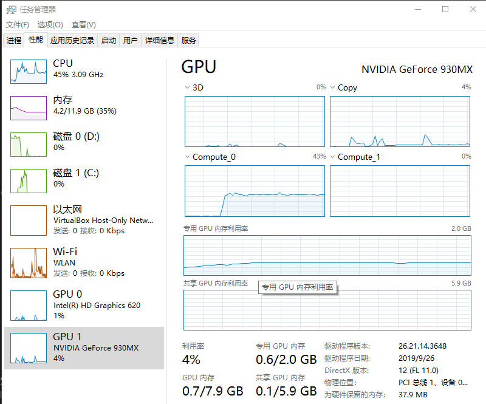

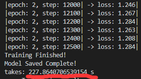

发现最后训练运行的时间不仅没有缩短，竟然还多了1分钟，于是又搜了原因，发现是因为上面吧batch_size设置为4，太小了，不能体现GPU的能力，于是就将BATCH_SIZE直接提高到100，再次复原到初始状态重新训练：

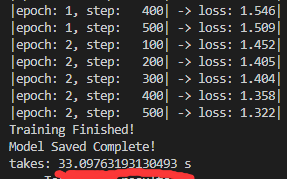

发现训练2次仅用了33秒，速度相当于用CPU运行的5倍，于是成功的使用GPU进行训练，并且节省了时间。

#### 最后开始集体训练

最后将EPOCH设为10，BATCH_SIZE设为100，一切恢复到初始状态开始从头训练，之后每次都在上一次训练得到的模型参数的基础上进行训练，经过7次的训练发现如下结果：

①从保存的loss1-7七张loss图中可以发现loss在不断减少，从2一直减少到0.3左右。

②但是，观察保存的TrainAccHistory.csv与TestAccHistory.csv：

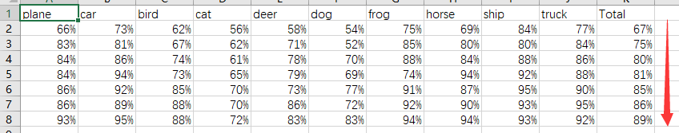

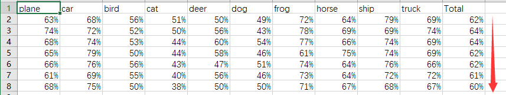

发现：训练集的测试结果的准确率在不断上升，而测试集测试的准确率却呈现出下降的趋势。

##### 推测原因

应该是出现了过拟合，导致不断训练时，训练集的准确率不断增大，而测试集的准确率不断减小。个人觉得可能因为定义的CNN网络结构不够最优；或是训练集与测试集的样本太少了，每一类才5000张用来训练，1000张用来测试。

#### 总结

通过本次实验，大致掌握了通过pytorch加载数据集，创建，训练和测试网络的过程。自己也加入了绘制loss图，保存每次测试准确度到csv文件中，并对结果进行的推测。感觉通过这次实验，对卷积神经网络的构建思路更加清晰了，也看到了库API的强大。