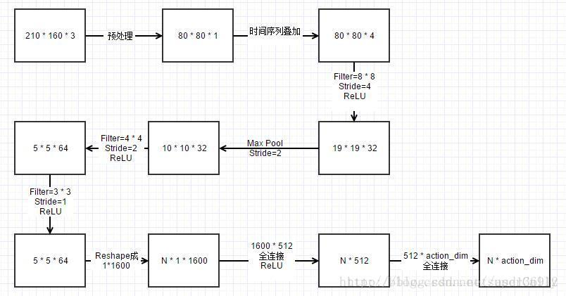

# Breakout-v0

> 还是按照时间顺序来介绍吧。
>
> 主要参考的网站：
>
> https://blog.sakuragawa.moe/environment-error-in-openai-gym-atari-with-pycharm/
>
> https://pytorch.org/tutorials/intermediate/reinforcement_q_learning.html 
>
> https://blog.csdn.net/superCally/article/details/54784103 
>
> https://www.bilibili.com/video/av45357759 ， https://gym.openai.com/docs/
>
> https://github.com/，  http://www0.cs.ucl.ac.uk/staff/D.Silver/web/Teaching.html  等。
>
> 很多图取自David Silver的教学PPT(上面最后一个链接)

## 安装gym，初次尝试

cmd，pip install gym[atari]回车安装，本以为就能顺利试一下简单例子了，结果在gym.make('Breakout-v0')的时候报以下错误：

```
OSError: [WinError 126] The specified module could not be found
```

开始寻找解决方案，先是根据大佬解答通过其他方式重新安装，结果不行，然后又搜到的都是说缺少dll文件，并且通过报错信息发现是ale_c.dll的问题，于是又到dll下载网站搜索ale_c.dll，发现压根就搜不到这个dll文件。因为是32系统的一个dll文件，不是64位的。最后在<a href=' https://blog.sakuragawa.moe/environment-error-in-openai-gym-atari-with-pycharm/ '>这里</a>找到了解决方案，这个网页最下方给出了方法，先到<a href=' https://github.com/Kojoley/atari-py/releases/ '>这里</a>下载跟python版本对应的atari_py，我的是64位，python3.6，所以下载的是 atari_py-1.2.1-cp36-cp36m-win_amd64.whl，之后到下载目录运行

```
pip install atari_py-1.2.1-cp36-cp36m-win_amd64.whl
```

之后即可成功运行gym.make('Breakout-v0')

## DQN

虽然环境配置好了，但是实际上对于强化学习基本上什么都不懂，后来看了B站的David Silver的视频第一节introduction还有一些博客，大致了解一些。从RL开始不断了解：

### RL Problem

强化学习的两大基本要素：**agent**(机器人)和**environment**(环境)，在每个时间t中：

1. agent做出行动$A_t$; 观察当前环境$O_t$; 并计算得到的奖励$R_t$.
2. environment相应的则会接收agent的动作$A_t$; 发送当前环境观测值$Q_(t+1)$; 发送奖励$R_(t+1)$; 为什么是t+1，因为环境得到agent的活动之后，这个活动会改变当期环境，所以反馈给agent的是下一时刻的观测值与奖励。

具体表示见课件中的这张图：


​                               **The brain means Agent, and the Earth means Environment**

用一个四元式表示即为$E=<S,A,P,R>$; $S$: 当前状态, $A$: agent做出的行动，$P$: 状态转移矩阵，$R$：得到的奖励reward。

**Policy**(策略)也是一个重要概念，从状态State到动作Action的过程称为一个策略Policy，表示一个agent的表现，用公式**$a = π(s)$**表示，强化学习的目标就是通过一个好的Policy，让总体的奖励reward最大。

但是对于一个"进入环境的agent"，并不知道最优的policy是什么，因此一开始都是使用随机的策略(Stochastic policy)， 先使用随机的策略进行不断地试验，得到一系列的状态，动作和奖励：
$$
\{S_1,A_1,R_1,S_2,A_2,R_2,...,S_n,A_n,R_n\}
$$
之后不断降低随机策略对于做出动作的比重，习得一个能使奖励reward最大的策略。

---

强化学习的主要方法：1.有模型学习(Bellman和策略迭代、值迭代)；2.无模型学习(蒙特卡洛方法，时序差分学习(Q-learning))；3.值函数近似；4.模仿学习

###MDP(Markov Decision Processes)

马尔科夫决策过程主要的想法是，在t时刻下的状态$S_t$只跟上一时刻(t-1)的状态$S_(t-1)$和行动$A(t-1)$有关，而跟历史的很多状态与行动无关，或者说：未来下一时刻的状态和行动action只跟当前时刻的状态和行动有关，跟在此之前所有状态和行动无关。也可以看出来：一个状态出于马尔科夫状态，整个状态链都出于马尔科夫状态。也即：


定义如下：


---

### Q-learning

Q learning初始化一个Q表，记录状态-动作对的值，agent从所有可能动作中选取一个动作，每一步由如下公式更新Q表，直到达到最优状态。

Q learning整体算法(图来自莫烦python)：


上图的那行为更新Q值的一种方式，并不是直接将Q估计值赋值给新的Q值，而是采用渐进的方式(类似梯度下降),向target迈进一小步，最后逐渐收敛。

$\epsilon$-greedy: 是用在决策上的一种策略，比如$\epsilon$ = 0.9时，就说明有90%的情况会按照Q表的最优值进行行动，10%的情况使用随机选择行动。$\alpha$是学习率，来决定这次的误差有多少是要被学习的，通常$\alpha$小于1，$\gamma$是衰减值(discount fator), 对未来reward的衰减值。

---

### dqn

通常是通过Q table记录Q learning，当状态越来越多时，这样的方式就显得效率太低。DQN实际上就是用Q-network代替Q table。

#### Train

论文中给出的算法是：


用到了随机采样，原因是玩Atari采集的样本是一个时间序列，样本之间具有连续性，如果每次得到样本就更新Q值，受样本分布的影响，效果会不好。使用Experience Replay，把样本先存起来，然后随机采样。

1. 初始化replay memory D 容量为N
2. 用一个深度神经网络作为Q值网络，初始化权重参数(random)
3. 设定游戏片段总数M
4. 初始化网络输入，大小为84\*84\*4，并且计算网络输出
5. 以概率$\epsilon$随机选择动作$A_t$或者通过网络输出的Q(max)值选择动作$A_t$.
6.  得到行动$A_t$后的奖励$R_t$和下一个网络的输入 
7.  根据当前的值计算下一时刻网络的输出 
8.  将四个参数作为此刻的状态一起存入到D中（D中存放着N个时刻的状态） 
9.  随机从D中取出minibatch个状态 (随即采样) 
10.  计算每一个状态的目标值（通过执行$A_t$后的reward来更新Q值作为目标值） 
11.  通过SGD更新权重

---

#### 网络结构




#### 后续improvement

1.Q值计算方法

2.随机采样的方法

3.改进网络结构，或者使用RNN(LSTM)等。

---

### 尝试

先试着运行博客里面提供的代码(见testblog文件夹)，先是看了该博主关于强化学习的三篇博客，对RL与DQN大致了解，然后复制下来，修改了一下python2的语法错误、tensorflow的api接口问题、模型数据保存路径改为./path/to/logs，不然在linux下/path/to/logs路径没有权限创建、添加以下语句使用GPU训练。

```python
import os
os.environ['CUDA_VISIBLE_DEVICE'] = '0'
```

试着调大batch_size = 128，之后开始运行，先是在自己电脑上跑，记录下开头：


平均每个episode只能得1分(汗)，然后又跑了一夜，起来发现才跑不到800个episode，而且效果也不是很理想：


平均每个episode只能得4分(5条命才得4分)。显然不是很行。而且按照这个速度，可能要没日没夜跑6,70天才能跑到设定的100000次。

或许调大batch_size并不能让收敛的速度加快，相反，甚至会让计算量增大，训练时间变长。于是恢复到默认值放到服务器里跑，结果第二天起来发现才900多就跟服务器断联了，结果也失败了。后来发现可以用下面命令在服务器后台创建一个终端来运行程序：

```python
tmux new -s Loner  # Longer 是取的一个标识符
# 进去之后可以执行代码
# 之后 ctrl+b，d退到之前的终端
# 如果想要重新进入：
tmux attach -t Longer # 即可重新进入后台终端
```

之后跑了好几天(two thousands years later...)，不幸的是进程被杀了，不过已经13000多episode了，虽然结果也不是很理想，不过意思到了。如下：


平均每个episode能得12分，较之前有进步，不过这效率实在太低了，跑了几天几夜才平均得12分。

发现在同目录下生成了一些logs，谷歌一下用法，发现可以用tensorboard可视化，在终端中运行：

```python
tensorboard --logdir the path of logs
# 最后接上logs所在目录，比如我这里就是运行:
tensorboard --logdir D:\大三上\人工智能原理\实验课\ExerDQN\testblog\path\to\logs
```

之后根据终端中的提示，在浏览器中打开'http://DESKTOP-35DV2DC:6006/'，可以得到一个很高逼格的图表，大致看一下好像是对网络结构的直观介绍：


当然还有其他很多功能，没有深究，就不列出了。

---

### 自己对DQN的尝试

然后发现自己到目前为止除了看了看原理之外好像也没干什么，于是试着也要做点什么。

后来参考资料以及一些视频教程，试着修改得到了一个可以训练测试Breakout的DQN(见mydqn文件夹)，有dqn_tf.py跟main.py。dqn_tf.py中定义了DQN网络和Agent两个类，main.py中则是创建环境，开始训练。

DQN中对图像的处理部分的卷积网络主要定义如下(在dqn_tf.py的DeepQNetwork类中)：

```python
def build_network(self):
        with tf.variable_scope(self.name):
            self.input = tf.placeholder(tf.float32,
                                        shape=[None, *self.input_dims],
                                        name='inputs')
            self.actions = tf.placeholder(tf.float32,
                                          shape=[None, self.n_actions],
                                          name='action_taken')
            self.q_target = tf.placeholder(tf.float32,
                                           shape=[None, self.n_actions],
                                           name='q_value')

            conv1 = tf.layers.conv2d(inputs=self.input, filters=32,
                                     kernel_size=(8,8), strides=4, name='conv1',
                     kernel_initializer=tf.variance_scaling_initializer(scale=2))
            conv1_activated = tf.nn.relu(conv1)


            conv2 = tf.layers.conv2d(inputs=conv1_activated, filters=64,
                                     kernel_size=(4,4), strides=2, name='conv2',
                      kernel_initializer=tf.variance_scaling_initializer(scale=2))
            conv2_activated = tf.nn.relu(conv2)


            conv3 = tf.layers.conv2d(inputs=conv2_activated, filters=128,
                                     kernel_size=(3,3),strides=1, name='conv3',
                      kernel_initializer=tf.variance_scaling_initializer(scale=2))
            conv3_activated = tf.nn.relu(conv3)

            flat = tf.layers.flatten(conv3_activated)
            dense1 = tf.layers.dense(flat, units=self.fc1_dims,
                                     activation=tf.nn.relu,
                    kernel_initializer=tf.variance_scaling_initializer(scale=2))

            self.Q_values = tf.layers.dense(dense1, units=self.n_actions,
                    kernel_initializer=tf.variance_scaling_initializer(scale=2))

            #self.q = tf.reduce_sum(tf.multiply(self.Q_values, self.actions))

            self.loss = tf.reduce_mean(tf.square(self.Q_values - self.q_target))

            self.train_op = tf.train.AdamOptimizer(self.lr).minimize(self.loss)
```

Agent类中主要定义了store_transition函数，choose_action函数，learn函数等。具体不贴了。

运行的时候有一个问题，需要linux下运行并且安装ffmpeg，因为没有权限，后来换了一个服务器跑的。

然后就还有一个问题，就像上面的dqn原理中讲的创建Agent的时候需要有一个replay memory来存样本，原本默认设置是25000，但是运行的时候会出现MemoryError，而且据原作者说25000的话会占用48G的RAM，于是降低mem_size到1000，batch_size为32，episode为5000(因为时间不太够了T_T)：

```python
agent = Agent(gamma=0.99, epsilon=1.0, alpha=0.00025, input_dims=(180,160,4),
                  n_actions=3, mem_size=1000, batch_size=32)
```

刚开始的时候记录一下：


跑完5000再记录一下：


## 发现大宝贝:A3C

### A3C是啥

Asynchronous Advantage Actor Critic，直接翻译就是异步优势演员评论家。下面从Actor Critic开始说

### Actor Critic

先看个图:


实际上强化学习可以通过Value-Based和Policy-Based进行分类，分别表示以值函数为中心和以策略为中心的算法，而Actor Critic就是两种方法的交汇部分。**Actor Criti**是一种值函数为中心和以策略为中心算法的结合体 、它合并了以值函数为基础 (like Q-learning) 和以动作概率为基础 (like Policy Gradients) 的两类强化学习的算法。这里的策略一般是指随机策略。

从策略梯度的角度来看，Actor Critic就是一种policy gradient，而从Critic部分使用不同策略评估实现来看，会有不同的Actor Critic形式，具体可见下图(实际上我看不懂)：


Actor Critic的优点(总的来说就是结合了Value-Based跟Policy-Based的优点):

- 相比Value-Based的算法，AC使用了策略梯度的做法，这能让它在连续动作或者高维动作空间中选取合适的动作，而Q-learning做这件事会很困难。
- 相比Policy-Based的算法，AC应用了Q-learning或其他决策评估的做法，使得AC能进行单步的更新，比单纯的Policy Gradient的效率更高。

#### Actor Critic具体算法

Actor Critic字面意思：演员-评论家，主要想法是：演员在演戏的时候同时有评论家指点，这样演员就会演员就会演得越来越好。同时专家也在不断进步，也就是对演员的动作评价的更加的准确，共同进步，使得效果越来越好。

基于Actor-Critic策略的梯度学习分为两部分：

1. Critic：参数化行为价值函数$Q_w(s, a)$
2. Actor: 按照Critic部分得到的价值引导策略函数参数$\theta$的更新。


可以看出，Critic做的事情其实就是策略评估，他要告诉个体，在由参数$\theta$确定的策略$\pi_\theta$到底表现得怎么样。关于策略评估可以使用蒙特卡洛策略评估、TD学习以及TD(λ)等方式实现。 

Critic通过近似线性的TD(0)更新$\omega$，Actor通过策略梯度更新$\theta$，具体算法流程为：


> 这是一个在线实时算法，针对每一步进行更新，不需要等到episode结束

在基于策略的学习算法中，算法挑选策略的时候不需使用$\epsilon$-greedy搜索，策略是根据参数θ得到的。同时在对策略参数进行更新时有一个学习率$\alpha$，它体现了在梯度方向上更新参数θ的步长（step size），一般的我们在更新参数时是按梯度方向只更新由$\alpha$确定的一定量。例如，当前策略在更新时提示梯度方向倾向于选择“向左”的行为，那么在更新策略参数时，可以朝着向左的方向更新一定的值，如果这个$\alpha$取值增大，则会导致决策朝着更容易选择“向左”的行为倾斜，这其实就相当于没有探索的greedy决策行为。而只要学习在持续，就有可能因为梯度变化而尝试更多的行为，参数在这一过程中起到了控制了策略更新平滑度的作用。

### A3C(Asynchronous Advantage Actor Critic)算法

论文地址： https://arxiv.org/pdf/1602.01783.pdf 

**A3C算法**：上面说的的DQN比传统RL算法有了巨大提升，其中一个主要原因就是使用了经验回放机制。然而，经验回放并不是唯一的能够打破数据相关性的方法。另一种方法就是使用**异步**的方法(是指数据是异步产生的)。A3C就是一个使用这种异步的方式。采用Actor Critic的框架，提升性能的同时通过异步加快训练。

据统计，A3C算法在Atari游戏上的平均成绩是通过DQN算法训练的4倍。可以说A3C算法比起了DQN在多方面成为了更好的深度增强学习算法。

A3C算法的基本思想：基本思想跟上面的Actor Critic基本相同，对输出的动作进行评估，如果好，就调整行动网络(Actor Network)使得该动作出现的可能性增加(演员被夸奖之后会在某个动作上刻意表演)。如果不好，就降低这个动作出现的概率。通过反复训练，得到最优的策略。论文给出的算法：


**创新与厉害之处**：A3C算法为了提升训练速度采用异步训练的思想，利用多线程。每个线程相当于一个Agent在探索，多个Agent共同探索， 并行计算策略梯度，对参数进行更新。相比DQN，A3C算法不需要使用经验池来存储历史样本并打乱数据相关性，节约了存储空间，并且采用异步训练，加倍了数据的采样速度，因此也提升了训练速度。与此同时，采用多个不同训练环境采集样本，样本的分布更加均匀，更有利于神经网络的训练。

### 开始使用

之后找了一个A3C的相关代码进行了简单修改(见RL_A3C文件夹)

主要模型定义在model.py中，如下：

```python
class A3Clstm(torch.nn.Module):
    def __init__(self, num_inputs, action_space):
        super(A3Clstm, self).__init__()
        self.conv1 = nn.Conv2d(num_inputs, 32, 5, stride=1, padding=2)
        self.maxp1 = nn.MaxPool2d(2, 2)
        self.conv2 = nn.Conv2d(32, 32, 5, stride=1, padding=1)
        self.maxp2 = nn.MaxPool2d(2, 2)
        self.conv3 = nn.Conv2d(32, 64, 4, stride=1, padding=1)
        self.maxp3 = nn.MaxPool2d(2, 2)
        self.conv4 = nn.Conv2d(64, 64, 3, stride=1, padding=1)
        self.maxp4 = nn.MaxPool2d(2, 2)

        self.lstm = nn.LSTMCell(1024, 512)
        num_outputs = action_space.n
        self.critic_linear = nn.Linear(512, 1)
        self.actor_linear = nn.Linear(512, num_outputs)

        self.apply(weights_init)
        relu_gain = nn.init.calculate_gain('relu')
        self.conv1.weight.data.mul_(relu_gain)
        self.conv2.weight.data.mul_(relu_gain)
        self.conv3.weight.data.mul_(relu_gain)
        self.conv4.weight.data.mul_(relu_gain)
        self.actor_linear.weight.data = norm_col_init(
            self.actor_linear.weight.data, 0.01)
        self.actor_linear.bias.data.fill_(0)
        self.critic_linear.weight.data = norm_col_init(
            self.critic_linear.weight.data, 1.0)
        self.critic_linear.bias.data.fill_(0)

        self.lstm.bias_ih.data.fill_(0)
        self.lstm.bias_hh.data.fill_(0)

        self.train()

    def forward(self, inputs):
        inputs, (hx, cx) = inputs
        x = F.relu(self.maxp1(self.conv1(inputs)))
        x = F.relu(self.maxp2(self.conv2(x)))
        x = F.relu(self.maxp3(self.conv3(x)))
        x = F.relu(self.maxp4(self.conv4(x)))

        x = x.view(x.size(0), -1)
        hx, cx = self.lstm(x, (hx, cx))
        x = hx
        return self.critic_linear(x), self.actor_linear(x), (hx, cx)
```

通过如下命令即可进行训练：

```
python main.py --env Breakout-v0 --workers 8 --gpu-ids 2 3 6 --amsgrad True
```

如果之前训练的有数据，可以带上 --load True参数读取数据，在其基础上训练。

当然还可以带其他有用的参数，不过这样就差不多了，主要参数介绍

| --lr      | 设定学习率，类似$\alpha$                                     |
| --------- | ------------------------------------------------------------ |
| --gamma   | 设定discount factor                                          |
| --workers | 用来训练时的进程数，默认32，如果爆内存之类的可以适当调小     |
| --env     | 设定游戏环境，默认Breakout-v0，还可以训练其他游戏            |
| --load    | 设定是否读取已有参数进行训练，默认为False，因为第一次训练并没有数据，之后可自行设定 |
| --gpu-ids | 指定用来训练的GPU设备的id，若为多个，用空格隔开              |
| --amsgrad | Adam optimizer amsgrad parameter                             |

见效很快，大概4小时就能达到400分。

测试的时候运行：

```
python gym_eval.py --num-episode 10 --render True --gpu-id 0
```

主要参数说明：

| --env          | 设置测试环境，不同环境会load不同的data，默认为Breakout-v0    |
| -------------- | ------------------------------------------------------------ |
| --num-episodes | 设置测试的次数                                               |
| --render       | 测试时是否显示游戏过程，默认为True，若在服务器上跑需要设为False |
| --gpu-id       | 用来测试的GPU的id，默认为CPU                                 |

下面是前面依次记录前面几次的得分数：


有时候出现0分是游戏bug，不出现球。所以3,4小时之后的结果就已经非常可观了。

之后又放在服务器一直跑，跑了好些天之后就非常稳了，有多次达到满分864分，其中一个保存在文件夹里的result.gif。


